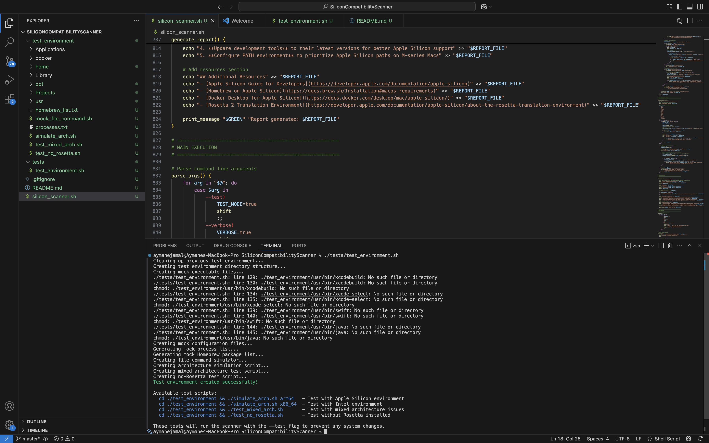

# Silicon Compatibility Scanner

A professional Bash-based diagnostic tool for analyzing Apple Silicon compatibility.

---

## Table of Contents

1. [Project Introduction](#project-introduction)
2. [Project Structure](#project-structure)
3. [Code Overview](#code-overview)
4. [Testing Environment](#testing-environment)
5. [Running the Scanner](#running-the-scanner)
6. [Report Format](#report-format)
7. [Future Improvements](#future-improvements)

---

## Project Introduction

The **Silicon Compatibility Scanner** is a professional Bash-based diagnostic tool designed to help developers transition smoothly from Intel/x86 platforms (Windows or macOS) to **Apple Silicon (ARM64)** devices.  
It analyzes the underlying system architecture, development environment, runtime processes, and Docker containers to identify potential compatibility issues when migrating to Apple Silicon.

The scanner not only detects problems (such as running x86 binaries through Rosetta 2) but also suggests concrete solutions, helping users optimize their environment for native ARM64 performance.  
A detailed **Markdown report** is automatically generated at the end of the scan, summarizing critical issues, warnings, and recommendations.

The project includes a fully isolated **testing environment** that allows validation of the scanner's behavior without affecting the real system, by simulating different system configurations (Apple Silicon, Intel, mixed architectures, missing Rosetta 2, etc.).

---

## Project Structure

| File/Folder | Description |
|:------------|:------------|
| `silicon_scanner.sh` | Core scanner script that runs all system checks and generates the report. |
| `test_environment.sh` | Utility script that sets up a simulated Apple Silicon/Intel environment to test the scanner safely. |
| `test_environment/` | Contains all the mock binaries, processes, configurations created during test runs. |
| `.gitignore` | Ensures generated or temporary files are not pushed to the Git repository. |
| `README.md` | Full explanation of the project, code architecture, usage, and contribution guidelines. |

---


# 📚 Code Overview


## Part 1: Script Setup and Configuration

```bash
#!/bin/bash
#
# Silicon Compatibility Scanner
# A diagnostic tool that identifies Apple Silicon compatibility issues for developers
# migrating from Windows/x86.
#

# =========================================================
# CONFIGURATION
# =========================================================

# Define color codes for output formatting
readonly RED='\033[0;31m'
readonly YELLOW='\033[0;33m'
readonly GREEN='\033[0;32m'
readonly BLUE='\033[0;34m'
readonly BOLD='\033[1m'
readonly RESET='\033[0m'

# Script version
readonly VERSION="1.0.0"

# Report file path
REPORT_FILE="silicon_compatibility_report_$(date +%Y%m%d_%H%M%S).md"

# Flags
TEST_MODE=false
VERBOSE=false

# Counters for issues found
CRITICAL_COUNT=0
WARNING_COUNT=0
INFO_COUNT=0
```

This first section sets up the script:

- The `#!/bin/bash` line tells the system to run this file using the Bash interpreter.

- Color codes are defined to make the terminal output more readable:
   - `RED` for critical errors
   - `YELLOW` for warnings
   - `GREEN` for success messages
   - `BLUE` for information
   - `BOLD` for emphasis
   - `RESET` to return to normal text

- The script version number is set. The `readonly` keyword ensures the value cannot be changed during runtime.

- A report filename is dynamically generated using the current date and time with `$(date +%Y%m%d_%H%M%S)`, ensuring each scan creates a unique report.  
  Example: `silicon_compatibility_report_20250423_142530.md`

- Two flags control the script’s behavior:
   - `TEST_MODE`: When true, simulates actions without making changes.
   - `VERBOSE`: When true, displays additional execution details.

- Counters are initialized to track discovered issues:
   - `CRITICAL_COUNT`: Number of critical issues.
   - `WARNING_COUNT`: Number of warnings.
   - `INFO_COUNT`: Number of informational messages.

This setup phase organizes all tools and configurations needed to perform the scanning operations that follow.


## Part 2: Helper Functions

```bash
# =========================================================
# HELPER FUNCTIONS
# =========================================================

# Print a message with color
print_message() {
    local color="$1"
    local message="$2"
    echo -e "${color}${message}${RESET}"
}

# Print a section header
print_header() {
    local message="$1"
    echo
    echo -e "${BOLD}${BLUE}=== ${message} ===${RESET}"
    echo
}

# Print verbose message only if verbose mode is enabled
print_verbose() {
    local message="$1"
    if [ "$VERBOSE" = true ]; then
        echo -e "${BLUE}[VERBOSE]${RESET} ${message}"
    fi
}

# Log an issue with severity level
log_issue() {
    local severity="$1"
    local message="$2"
    local solution="$3"
    
    case "$severity" in
        "CRITICAL")
            print_message "${RED}[CRITICAL]${RESET}" "${message}"
            CRITICAL_COUNT=$((CRITICAL_COUNT + 1))
            ;;
        "WARNING")
            print_message "${YELLOW}[WARNING]${RESET}" "${message}"
            WARNING_COUNT=$((WARNING_COUNT + 1))
            ;;
        "INFO")
            print_message "${GREEN}[INFO]${RESET}" "${message}"
            INFO_COUNT=$((INFO_COUNT + 1))
            ;;
    esac
    
    if [ -n "$solution" ]; then
        echo -e "   ${BOLD}Solution:${RESET} ${solution}"
    fi
    
    # Add to report file
    echo "- **${severity}:** ${message}" >> "$REPORT_FILE"
    if [ -n "$solution" ]; then
        echo "  - Solution: ${solution}" >> "$REPORT_FILE"
    fi
    echo >> "$REPORT_FILE"
}

# Check if running in test mode
is_test_mode() {
    if [ "$TEST_MODE" = true ]; then
        return 0
    else
        return 1
    fi
}

# Run a command with test mode awareness
run_command() {
    local command="$1"
    
    if is_test_mode; then
        echo "[TEST MODE] Would run: $command"
        return 0
    else
        if [ "$VERBOSE" = true ]; then
            echo -e "${BLUE}[RUNNING]${RESET} $command"
        fi
        eval "$command"
        return $?
    fi
}

# Check if binary exists and determine its architecture
check_binary_arch() {
    local binary_path="$1"
    
    # Check if binary exists
    if [ ! -f "$binary_path" ]; then
        print_verbose "Binary not found: $binary_path"
        return 1
    fi
    
    # Use file command to determine architecture
    local file_output
    file_output=$(file "$binary_path" 2>/dev/null)
    
    if [[ "$file_output" == *"Mach-O 64-bit executable arm64"* ]]; then
        echo "arm64"
        return 0
    elif [[ "$file_output" == *"Mach-O 64-bit executable x86_64"* ]]; then
        echo "x86_64"
        return 0
    elif [[ "$file_output" == *"Mach-O universal binary"* ]]; then
        if [[ "$file_output" == *"arm64"* ]]; then
            echo "universal (includes arm64)"
            return 0
        else
            echo "universal (x86_64 only)"
            return 0
        fi
    else
        echo "unknown"
        return 1
    fi
}
```

This section contains helper functions - small, reusable pieces of code that make our script more organized:

1. `print_message()`: Prints text in a specific color. It takes two parameters:
   - `$1`: The color to use (like RED, GREEN)
   - `$2`: The message to display
     The `${RESET}` at the end returns the text color back to normal.

2. `print_header()`: Prints a section title with blue, bold text and spacing. This helps organize the output into clear sections.

3. `print_verbose()`: Only prints a message if verbose mode is enabled. This keeps the regular output clean while allowing detailed output when needed.

4. `log_issue()`: This function does several important things:
   - Takes an issue severity (CRITICAL, WARNING, INFO)
   - Takes a message describing the issue
   - Takes an optional solution
   - Prints the issue in the appropriate color
   - Increases the counter for that type of issue
   - Adds the issue to our report file with markdown formatting
   - The `case` statement checks which severity level we're dealing with and formats accordingly

5. `is_test_mode()`: A simple function that returns true (0 in bash) if we're in test mode. This makes our code more readable.

6. `run_command()`: Safely runs a command based on test mode:
   - If in test mode, it just shows what it would run
   - If not in test mode, it runs the command
   - If verbose mode is on, it shows what command is being run

7. `check_binary_arch()`: This important function:
   - Takes a path to a binary (program)
   - Checks if the file exists
   - Uses the `file` command to determine what architecture the binary is for (ARM64, x86_64, or universal)
   - Returns the architecture as text
   - The `*"text"*` pattern is checking if "text" appears anywhere in the output

This group of functions forms the core toolkit our script will use. They're like building blocks we'll combine to create more complex functionality.

## Part 3: System Architecture Detection

```bash
# =========================================================
# SYSTEM DETECTION FUNCTIONS
# =========================================================

# Detect system architecture
detect_architecture() {
    print_header "Detecting System Architecture"
    
    # Check if running on Apple Silicon
    if [ "$(sysctl -n hw.optional.arm64 2>/dev/null)" = "1" ]; then
        print_message "$GREEN" "✓ System is running on Apple Silicon"
        IS_APPLE_SILICON=true
    else
        print_message "$YELLOW" "⚠ System is not running on Apple Silicon (Intel-based Mac)"
        IS_APPLE_SILICON=false
    fi
    
    # Check current architecture
    CURRENT_ARCH=$(uname -m)
    print_message "$BLUE" "Current architecture: $CURRENT_ARCH"
    
    # Check chip model
    CHIP_MODEL=$(sysctl -n machdep.cpu.brand_string 2>/dev/null)
    print_message "$BLUE" "Processor: $CHIP_MODEL"
    
    # Check Rosetta 2 status
    if [ "$IS_APPLE_SILICON" = true ]; then
        if [ -f "/Library/Apple/usr/libexec/oah/libRosettaRuntime" ]; then
            print_message "$GREEN" "✓ Rosetta 2 is installed"
            ROSETTA_INSTALLED=true
        else
            print_message "$YELLOW" "⚠ Rosetta 2 is not installed"
            ROSETTA_INSTALLED=false
            log_issue "WARNING" "Rosetta 2 is not installed, which may cause issues with Intel-based applications" \
                     "Install Rosetta 2 by running: softwareupdate --install-rosetta"
        fi
    fi
    
    # Check macOS version
    MACOS_VERSION=$(sw_vers -productVersion)
    print_message "$BLUE" "macOS version: $MACOS_VERSION"
    
    # Check if macOS version is compatible with Apple Silicon
    if [ "$(echo "$MACOS_VERSION" | cut -d. -f1)" -lt 11 ]; then
        log_issue "CRITICAL" "macOS version $MACOS_VERSION is not compatible with Apple Silicon" \
                 "Upgrade to macOS 11 (Big Sur) or newer"
    fi
    
    # Check if system is running in native mode
    if [ "$IS_APPLE_SILICON" = true ] && [ "$CURRENT_ARCH" != "arm64" ]; then
        log_issue "CRITICAL" "System is Apple Silicon but running in x86_64 mode" \
                 "Restart Terminal in native ARM64 mode"
    fi
    
    # Add architecture information to report
    echo "## System Information" >> "$REPORT_FILE"
    echo "- **Processor Type:** $CHIP_MODEL" >> "$REPORT_FILE"
    echo "- **Architecture:** $CURRENT_ARCH" >> "$REPORT_FILE"
    echo "- **macOS Version:** $MACOS_VERSION" >> "$REPORT_FILE"
    echo "- **Apple Silicon:** $([ "$IS_APPLE_SILICON" = true ] && echo "Yes" || echo "No")" >> "$REPORT_FILE"
    echo "- **Rosetta 2:** $([ "$ROSETTA_INSTALLED" = true ] && echo "Installed" || echo "Not installed")" >> "$REPORT_FILE"
    echo >> "$REPORT_FILE"
}
```

This section contains the `detect_architecture()` function, which is responsible for identifying the system's hardware and architecture:

1. First, we print a header to show we're starting the system detection section.

2. We check if the system is running on Apple Silicon:
   - We use the `sysctl -n hw.optional.arm64` command, which returns "1" if the system has Apple Silicon
   - `2>/dev/null` means "don't show any error messages"
   - We store the result in the `IS_APPLE_SILICON` variable for use throughout the script

3. We check what architecture the system is currently running:
   - `uname -m` reports the machine hardware name (like "arm64" or "x86_64")
   - We store this in `CURRENT_ARCH`

4. We get the specific processor model:
   - `sysctl -n machdep.cpu.brand_string` returns the processor name
   - This might show "Apple M1 Pro" or "Intel Core i7" etc.

5. If the system is Apple Silicon, we check if Rosetta 2 is installed:
   - We look for a specific Rosetta file at "/Library/Apple/usr/libexec/oah/libRosettaRuntime"
   - If it's missing, we log a warning since Rosetta is needed for Intel apps

6. We check the macOS version:
   - `sw_vers -productVersion` returns the macOS version (like "12.3.1")
   - Then we check if the major version number is at least 11 (Big Sur)
   - Apple Silicon requires at least macOS 11, so we log a critical issue if it's older

7. We detect if an Apple Silicon Mac is running in Intel mode:
   - If the system is Apple Silicon but the current architecture isn't "arm64"
   - This would indicate the Terminal itself is running under Rosetta 2

8. Finally, we add all this system information to the Markdown report file using `>>` to append to the file.

This function is like the first doctor's examination - it's determining the basic system characteristics before we dive deeper into specific compatibility issues.

## Part 4: Package Manager Checks

```bash
# =========================================================
# DEVELOPER ENVIRONMENT FUNCTIONS
# =========================================================

# Check package managers
check_package_managers() {
    print_header "Checking Package Managers"
    
    # Create package managers section in report
    echo "## Package Managers" >> "$REPORT_FILE"
    
    # Check Homebrew
    if command -v brew >/dev/null 2>&1; then
        HOMEBREW_PREFIX=$(brew --prefix)
        print_message "$GREEN" "✓ Homebrew is installed at: $HOMEBREW_PREFIX"
        
        # Check if Homebrew is installed in the correct location for the architecture
        if [ "$IS_APPLE_SILICON" = true ] && [ "$HOMEBREW_PREFIX" = "/usr/local" ]; then
            log_issue "WARNING" "Homebrew is installed in the Intel location (/usr/local) instead of the Apple Silicon location (/opt/homebrew)" \
                     "Consider reinstalling Homebrew for Apple Silicon: /bin/bash -c \"\$(curl -fsSL https://raw.githubusercontent.com/Homebrew/install/HEAD/install.sh)\""
        elif [ "$IS_APPLE_SILICON" = false ] && [ "$HOMEBREW_PREFIX" = "/opt/homebrew" ]; then
            log_issue "WARNING" "Homebrew is installed in the Apple Silicon location (/opt/homebrew) on an Intel Mac" \
                     "This is unusual. Consider reinstalling Homebrew: /bin/bash -c \"\$(curl -fsSL https://raw.githubusercontent.com/Homebrew/install/HEAD/install.sh)\""
        fi
        
        # Check Homebrew packages with native alternatives
        print_verbose "Checking Homebrew packages architecture..."
        echo "### Homebrew Packages" >> "$REPORT_FILE"
        
        # Get list of installed packages
        if is_test_mode; then
            echo "[TEST MODE] Would check Homebrew packages"
        else
            local brew_list
            brew_list=$(brew list --formula 2>/dev/null)
            
            for package in $brew_list; do
                # Get package info
                local bin_path
                bin_path=$(which "$package" 2>/dev/null)
                
                if [ -n "$bin_path" ]; then
                    local arch
                    arch=$(check_binary_arch "$bin_path")
                    
                    if [ "$IS_APPLE_SILICON" = true ] && [[ "$arch" == *"x86_64"* ]] && [[ "$arch" != *"universal"* ]]; then
                        log_issue "WARNING" "Package '$package' is Intel-only ($arch) and running through Rosetta 2" \
                                 "Try reinstalling with: brew reinstall $package"
                        echo "  - $package: $arch ($bin_path)" >> "$REPORT_FILE"
                    elif [ "$VERBOSE" = true ]; then
                        print_verbose "Package '$package' architecture: $arch"
                        echo "  - $package: $arch ($bin_path)" >> "$REPORT_FILE"
                    fi
                fi
            done
        fi
    else
        print_message "$YELLOW" "⚠ Homebrew is not installed"
        echo "- Homebrew: Not installed" >> "$REPORT_FILE"
    fi
    
    echo >> "$REPORT_FILE"
```

This is the beginning of the package manager check function, focusing on Homebrew:

1. We start by printing a header for the Package Managers section.

2. We add a section title to our Markdown report file.

3. We check if Homebrew is installed:
   - `command -v brew` checks if the `brew` command exists
   - `>/dev/null 2>&1` means "ignore all output and errors"

4. If Homebrew is installed, we get its installation location:
   - `brew --prefix` returns the base path where Homebrew is installed
   - This is crucial because Homebrew uses different paths for Intel vs Apple Silicon

5. We check if Homebrew is in the correct location:
   - On Apple Silicon, it should be in `/opt/homebrew`
   - On Intel, it should be in `/usr/local`
   - If it's in the wrong location, we log a warning with instructions on how to reinstall

6. Next, we prepare to check individual Homebrew packages:
   - In test mode, we just print what we would do
   - Otherwise, we get a list of all installed Homebrew packages with `brew list --formula`

7. For each package, we:
   - Find its executable path using `which`
   - Check its architecture using our `check_binary_arch` function
   - If we're on Apple Silicon but the package is Intel-only (x86_64) and not universal, we log a warning
   - We suggest reinstalling the package to get a native version
   - We also add this information to the report

8. If Homebrew isn't installed, we note that in both the console output and the report.

This function is like checking if a toolkit has the right adapters for the job - we're making sure the package manager (Homebrew) is properly configured for the system architecture.

## Part 5: Node.js and npm Checks

```bash
    # Check Node.js and npm
    if command -v node >/dev/null 2>&1; then
        local node_path
        local node_arch
        local node_version
        
        node_path=$(which node)
        node_arch=$(check_binary_arch "$node_path")
        node_version=$(node --version 2>/dev/null)
        
        print_message "$GREEN" "✓ Node.js $node_version is installed ($node_arch)"
        echo "### Node.js" >> "$REPORT_FILE"
        echo "- **Version:** $node_version" >> "$REPORT_FILE"
        echo "- **Architecture:** $node_arch" >> "$REPORT_FILE"
        
        if [ "$IS_APPLE_SILICON" = true ] && [[ "$node_arch" == *"x86_64"* ]] && [[ "$node_arch" != *"universal"* ]]; then
            log_issue "WARNING" "Node.js is running under Rosetta 2 ($node_arch)" \
                     "Consider installing the ARM64 version: https://nodejs.org/"
        fi
        
        # Check for native modules in Node.js projects
        if command -v npm >/dev/null 2>&1 && [ "$IS_APPLE_SILICON" = true ]; then
            print_verbose "Checking for Node.js native modules..."
            
            # Look for package.json files in common locations
            local package_json_files
            if is_test_mode; then
                echo "[TEST MODE] Would search for package.json files"
            else
                # Only look in home directory and common project folders to avoid being too intrusive
                package_json_files=$(find "$HOME/Documents" "$HOME/Projects" "$HOME/repos" "$HOME/src" -name "package.json" -type f 2>/dev/null | head -n 10)
                
                if [ -n "$package_json_files" ]; then
                    echo "- **Native Module Check:** Found $(echo "$package_json_files" | wc -l | xargs) package.json files to check" >> "$REPORT_FILE"
                    
                    while IFS= read -r package_file; do
                        # Check if package.json contains native dependencies
                        if grep -q "\"dependencies\"\|\"devDependencies\"" "$package_file" 2>/dev/null; then
                            local project_dir
                            project_dir=$(dirname "$package_file")
                            local project_name
                            project_name=$(basename "$project_dir")
                            
                            print_verbose "Checking project: $project_name ($project_dir)"
                            
                            # Look for node_modules with native bindings 
                            if [ -d "$project_dir/node_modules" ]; then
                                local native_modules
                                native_modules=$(find "$project_dir/node_modules" -name "binding.gyp" -o -name "*.node" 2>/dev/null | head -n 5)
                                
                                if [ -n "$native_modules" ]; then
                                    log_issue "INFO" "Project '$project_name' contains native modules that might need recompilation for Apple Silicon" \
                                             "Run 'npm rebuild' in the project directory"
                                    echo "  - Project: $project_name contains native modules" >> "$REPORT_FILE"
                                fi
                            fi
                        fi
                    done <<< "$package_json_files"
                fi
            fi
        fi
    else
        print_message "$BLUE" "Node.js is not installed, skipping checks"
        echo "### Node.js: Not installed" >> "$REPORT_FILE"
    fi
    
    echo >> "$REPORT_FILE"
```

This section continues the package manager checks, focusing on Node.js and npm:

1. We check if Node.js is installed using `command -v node`.

2. If it is, we gather information about it:
   - We find the path to the Node.js executable with `which node`
   - We determine its architecture using our `check_binary_arch` function
   - We get its version with `node --version`

3. We print this information and add it to our report.

4. If we're on Apple Silicon but Node.js is Intel-only (x86_64) and not universal, we log a warning:
   - This means Node.js is running under Rosetta 2, which is less efficient
   - We suggest installing the ARM64 native version

5. Next, we check for native modules in Node.js projects:
   - Native modules are pieces of compiled code that might need to be rebuilt for Apple Silicon
   - We only do this check if npm is installed and we're on Apple Silicon

6. To find native modules:
   - We search for package.json files in common project folders
   - We limit to the first 10 files to avoid excessive searching
   - For each package.json, we check if it has dependencies
   - Then we look for signs of native modules like "binding.gyp" files or ".node" files
   - If found, we log an informational issue suggesting to run 'npm rebuild'

7. If Node.js isn't installed, we note that and skip these checks.

This part of the script is like checking if a toolkit's specialized components are compatible with the new system - we're looking for Node.js native modules that might need to be rebuilt specifically for Apple Silicon.

## Part 7: PATH Environment Variable Check

```bash
# Check PATH configuration
check_path_configuration() {
    print_header "Checking PATH Configuration"
    
    # Add PATH section to report
    echo "## PATH Environment Variable" >> "$REPORT_FILE"
    
    # Get PATH environment variable
    local path_var="$PATH"
    print_verbose "Current PATH: $path_var"
    
    # Add to report
    echo '```' >> "$REPORT_FILE"
    echo "$path_var" | tr ':' '\n' >> "$REPORT_FILE"
    echo '```' >> "$REPORT_FILE"
    
    if [ "$IS_APPLE_SILICON" = true ]; then
        # Check if /opt/homebrew/bin is in PATH
        if [[ $path_var != *"/opt/homebrew/bin"* ]] && [ -d "/opt/homebrew/bin" ]; then
            log_issue "WARNING" "Apple Silicon Homebrew directory (/opt/homebrew/bin) is not in PATH" \
                     "Add 'export PATH=/opt/homebrew/bin:\$PATH' to your shell profile"
        fi
        
        # Check if /opt/homebrew/bin comes before /usr/local/bin for Apple Silicon
        if [[ $path_var == *"/usr/local/bin"*"/opt/homebrew/bin"* ]]; then
            log_issue "WARNING" "Intel path (/usr/local/bin) appears before Apple Silicon path (/opt/homebrew/bin) in PATH" \
                     "Reorder PATH in your shell profile to put /opt/homebrew/bin first"
        fi
    else
        # Check if /usr/local/bin is in PATH for Intel
        if [[ $path_var != *"/usr/local/bin"* ]] && [ -d "/usr/local/bin" ]; then
            log_issue "WARNING" "Intel Homebrew directory (/usr/local/bin) is not in PATH" \
                     "Add 'export PATH=/usr/local/bin:\$PATH' to your shell profile"
        fi
    fi
    
    echo >> "$REPORT_FILE"
}
```

This function checks if the PATH environment variable is correctly configured:

1. We start by printing a header for the PATH Configuration section.

2. We add a section title to our report file.

3. We get the current PATH environment variable:
   - The PATH is a list of directories where the system looks for commands
   - It's separated by colons, like: "/opt/homebrew/bin:/usr/local/bin:/usr/bin"

4. We add the PATH to our report file in a readable format:
   - We use Markdown code block markers (```) to format it nicely
   - We use `tr ':' '\n'` to replace colons with newlines, so each directory is on its own line

5. If we're on Apple Silicon, we perform Apple Silicon-specific checks:
   - We check if "/opt/homebrew/bin" (the Apple Silicon Homebrew path) is in the PATH
   - If it exists but isn't in the PATH, we log a warning
   - We also check if it appears AFTER "/usr/local/bin" (the Intel path)
   - The order matters because the system uses the first matching command it finds
   - If Apple Silicon paths come after Intel paths, the system might use Intel binaries even when native ones are available

6. If we're on Intel, we check if the Intel Homebrew path ("/usr/local/bin") is in the PATH.

7. For any issues found, we provide specific solutions to fix the PATH order in the shell profile.

This function is like checking if the road map to find tools is correct - if the PATH is configured incorrectly, the system might use Intel tools when ARM64 versions are available, leading to unnecessary use of Rosetta 2 and reduced performance.

## Part 8: Process Check for Rosetta 2

```bash
# Check processes running under Rosetta 2
check_rosetta_processes() {
    print_header "Checking Processes Running Under Rosetta 2"
    
    # Add Rosetta processes section to report
    echo "## Processes Running Under Rosetta 2" >> "$REPORT_FILE"
    
    if [ "$IS_APPLE_SILICON" = true ]; then
        echo "Checking for processes running under Rosetta 2 emulation..."
        
        if is_test_mode; then
            echo "[TEST MODE] Would check for Rosetta processes"
            return 0
        fi
        
        # Get list of running processes with architecture
        local processes
        processes=$(ps -A -o pid,command | grep -v "grep" | grep -v " ps -" | grep -v " PID " | grep -v "$REPORT_FILE")
        
        # Initialize counter for Rosetta processes
        local rosetta_count=0
        local critical_processes=()
        local dev_processes=()
        
        echo "### Active Processes Under Rosetta" >> "$REPORT_FILE"
        
        while IFS= read -r line; do
            local pid
            pid=$(echo "$line" | awk '{print $1}')
            local command_path
            command_path=$(echo "$line" | awk '{print $2}')
            local command_name
            command_name=$(basename "$command_path" 2>/dev/null)
            
            # Skip empty lines
            [ -z "$pid" ] && continue
            
            # Get architecture using process_info
            local arch
            arch=$(ps -p "$pid" -o arch= 2>/dev/null)
            
            if [ "$arch" = "x86_64" ]; then
                rosetta_count=$((rosetta_count + 1))
                
                # Check if it has an ARM64 alternative
                local native_alternative=""
                local arm_command_path=""
                
                if [[ "$command_path" == "/usr/local/"* ]]; then
                    # Check if an ARM version exists in /opt/homebrew
                    arm_command_path="/opt/homebrew/${command_path#/usr/local/}"
                    if [ -f "$arm_command_path" ]; then
                        native_alternative="$arm_command_path"
                    fi
                fi
                
                # Categorize Rosetta processes
                if [[ "$command_name" == "node" || 
                      "$command_name" == "npm" || 
                      "$command_name" == "java" || 
                      "$command_name" == "python"* || 
                      "$command_name" == "ruby" || 
                      "$command_name" == "perl" || 
                      "$command_name" == "gcc" || 
                      "$command_name" == "clang" ]]; then
                    dev_processes+=("$command_name (PID: $pid)")
                    
                    # Add to report
                    echo "- $command_name (PID: $pid)" >> "$REPORT_FILE"
                    
                    if [ -n "$native_alternative" ]; then
                        echo "  - Native alternative: $native_alternative" >> "$REPORT_FILE"
                    fi
                    
                    log_issue "WARNING" "Development tool '$command_name' (PID: $pid) is running under Rosetta 2" \
                             "Consider using the ARM64 native version if available"
                fi
                
                if [ "$VERBOSE" = true ]; then
                    print_verbose "Process $command_name (PID: $pid) is running under Rosetta 2"
                    if [ -n "$native_alternative" ]; then
                        print_verbose "  Native alternative: $native_alternative"
                    fi
                fi
            fi
        done <<< "$processes"
        
        if [ "$rosetta_count" -eq 0 ]; then
            print_message "$GREEN" "✓ No processes running under Rosetta 2"
            echo "No processes detected running under Rosetta 2." >> "$REPORT_FILE"
        else
            print_message "$YELLOW" "⚠ Found $rosetta_count processes running under Rosetta 2"
            
            if [ ${#dev_processes[@]} -gt 0 ]; then
                print_message "$YELLOW" "⚠ Development tools running under Rosetta 2:"
                for proc in "${dev_processes[@]}"; do
                    echo "  - $proc"
                done
            fi
        fi
    else
        print_message "$BLUE" "Skipping Rosetta process check on Intel Mac"
        echo "Skipping Rosetta process check on Intel Mac." >> "$REPORT_FILE"
    fi
    
    echo >> "$REPORT_FILE"
}
```

This function checks for processes running under Rosetta 2 emulation:

1. We start by printing a header for the Rosetta processes section.

2. We add a section title to our report.

3. This check only makes sense on Apple Silicon, so we check if we're on Apple Silicon first.

4. In test mode, we just show what we would do and return early.

5. Otherwise, we get a list of all running processes:
   - `ps -A -o pid,command` lists all processes with their PIDs and commands
   - We filter out some irrelevant lines using `grep -v`

6. We initialize counters to track Rosetta processes.

7. For each process line, we:
   - Extract the process ID (PID) and command path
   - Get the base command name
   - Skip empty lines
   - Check the architecture of this specific process using `ps -p "$pid" -o arch=`

8. If a process is running as "x86_64" on Apple Silicon, it means it's using Rosetta 2:
   - We increment our Rosetta count
   - We check if a native ARM64 alternative exists by looking in /opt/homebrew for the same binary
   - We specifically watch for development tools (node, npm, python, etc.)
   - If we find development tools running under Rosetta, we log them as warnings
   - We suggest using native ARM64 versions if available

9. After checking all processes, we summarize:
   - If no Rosetta processes were found, we print a success message
   - Otherwise, we show how many were found and list the development tools specifically

10. If we're on an Intel Mac, we skip this check entirely.

This function is like checking which factory machines are running in power-saving mode when they could be running at full speed - it identifies processes that are unnecessarily using Rosetta 2 emulation when native versions might be available, which can impact performance and battery life.

## Part 9: Docker Configuration Check

```bash
# =========================================================
# DOCKER CHECKS
# =========================================================

check_docker() {
    print_header "Checking Docker Configuration"
    
    # Add Docker section to report
    echo "## Docker Configuration" >> "$REPORT_FILE"
    
    # Check if Docker is installed
    if command -v docker >/dev/null 2>&1; then
        print_message "$GREEN" "✓ Docker is installed"
        echo "- Docker is installed" >> "$REPORT_FILE"
        
        # Check Docker version
        local docker_version
        docker_version=$(docker --version 2>/dev/null)
        print_message "$BLUE" "Docker version: $docker_version"
        echo "- **Version:** $docker_version" >> "$REPORT_FILE"
        
        # Check Docker architecture
        local docker_path
        local docker_arch
        
        docker_path=$(which docker)
        docker_arch=$(check_binary_arch "$docker_path")
        
        print_message "$BLUE" "Docker binary architecture: $docker_arch"
        echo "- **Binary Architecture:** $docker_arch" >> "$REPORT_FILE"
        
        if [ "$IS_APPLE_SILICON" = true ] && [[ "$docker_arch" == *"x86_64"* ]] && [[ "$docker_arch" != *"universal"* ]]; then
            log_issue "WARNING" "Docker is running under Rosetta 2 ($docker_arch)" \
                     "Install the Apple Silicon version of Docker Desktop from https://www.docker.com/products/docker-desktop"
        fi
        
        # Check if Docker is running
        if is_test_mode; then
            echo "[TEST MODE] Would check if Docker is running"
        else
            if docker info >/dev/null 2>&1; then
                print_message "$GREEN" "✓ Docker daemon is running"
                echo "- Docker daemon is running" >> "$REPORT_FILE"
                
                # Check platform
                local docker_platform
                docker_platform=$(docker info --format '{{.Architecture}}' 2>/dev/null)
                
                if [ -n "$docker_platform" ]; then
                    print_message "$BLUE" "Docker platform: $docker_platform"
                    echo "- **Platform:** $docker_platform" >> "$REPORT_FILE"
                    
                    if [ "$IS_APPLE_SILICON" = true ] && [ "$docker_platform" != "arm64" ]; then
                        log_issue "WARNING" "Docker is not running in native ARM64 mode ($docker_platform)" \
                                 "Check Docker Desktop settings to enable ARM64 support"
                    fi
                fi
                
                # Check for running containers
                local containers
                containers=$(docker ps --format '{{.Image}} ({{.ID}})' 2>/dev/null)
                
                if [ -n "$containers" ]; then
                    print_message "$BLUE" "Running containers found:"
                    echo "### Running Containers" >> "$REPORT_FILE"
                    
                    while IFS= read -r container; do
                        echo "  - $container"
                        echo "- $container" >> "$REPORT_FILE"
                        
                        # Get container architecture
                        local container_id
                        container_id=$(echo "$container" | sed -E 's/.*\(([a-zA-Z0-9]+)\)/\1/')
                        
                        if [ -n "$container_id" ]; then
                            local container_arch
                            container_arch=$(docker inspect --format='{{.Architecture}}' "$container_id" 2>/dev/null)
                            
                            if [ -n "$container_arch" ]; then
                                echo "  - Architecture: $container_arch"
                                echo "  - Architecture: $container_arch" >> "$REPORT_FILE"
                                
                                if [ "$IS_APPLE_SILICON" = true ] && [ "$container_arch" = "amd64" ]; then
                                    log_issue "INFO" "Container $container is running with x86_64/amd64 architecture on Apple Silicon" \
                                             "This container is using emulation, which may impact performance"
                                fi
                            fi
                        fi
                    done <<< "$containers"
                else
                    print_message "$BLUE" "No running containers"
                    echo "- No running containers" >> "$REPORT_FILE"
                fi
                
                # Check Docker configuration file
                if [ -f "$HOME/.docker/config.json" ]; then
                    print_verbose "Docker config file found: $HOME/.docker/config.json"
                    
                    # Check for platform configurations
                    if grep -q "\"platform\"" "$HOME/.docker/config.json" 2>/dev/null; then
                        local platform_config
                        platform_config=$(grep -A 3 "\"platform\"" "$HOME/.docker/config.json" 2>/dev/null)
                        
                        print_verbose "Platform configuration found: $platform_config"
                        echo "### Docker Platform Configuration" >> "$REPORT_FILE"
                        echo '```json' >> "$REPORT_FILE"
                        echo "$platform_config" >> "$REPORT_FILE"
                        echo '```' >> "$REPORT_FILE"
                        
                        if [ "$IS_APPLE_SILICON" = true ] && [[ "$platform_config" == *"linux/amd64"* ]]; then
                            log_issue "WARNING" "Docker is configured to use x86_64/amd64 platform by default" \
                                     "Update Docker configuration to use linux/arm64 platform for better performance"
                        fi
                    fi
                fi
            else
                print_message "$YELLOW" "⚠ Docker is installed but not running"
                echo "- Docker is installed but not running" >> "$REPORT_FILE"
                log_issue "INFO" "Docker is installed but not running" \
                         "Start Docker Desktop from the Applications folder"
            fi
        fi
    else
        print_message "$BLUE" "Docker is not installed, skipping Docker checks"
        echo "- Docker is not installed" >> "$REPORT_FILE"
    fi
    
    echo >> "$REPORT_FILE"
}
```

This function checks Docker configuration for Apple Silicon compatibility:

1. We start by printing a header for the Docker Configuration section.

2. We add a section title to our report.

3. We check if Docker is installed using `command -v docker`.

4. If Docker is installed, we:
   - Get its version using `docker --version`
   - Find the Docker binary path using `which docker`
   - Check the architecture of the Docker binary using our `check_binary_arch` function
   - Log a warning if Docker is running under Rosetta 2 on Apple Silicon

5. We then check if the Docker daemon is running by trying `docker info`:
   - If it's running, we check what platform (architecture) Docker is using
   - On Apple Silicon, it should be using "arm64" for best performance
   - If it's not, we log a warning

6. We check for running containers:
   - We get a list of containers using `docker ps`
   - For each container, we extract its ID and use `docker inspect` to check its architecture
   - If a container is running as "amd64" (x86_64) on Apple Silicon, we log an informational message
   - This means the container is using emulation, which may impact performance

7. We also check the Docker configuration file:
   - If `~/.docker/config.json` exists, we look for platform settings
   - If Docker is configured to use "linux/amd64" by default on Apple Silicon, we log a warning
   - We suggest changing to "linux/arm64" for better performance

8. If Docker is installed but not running, we note that.

9. If Docker is not installed, we skip these checks.

This function is like checking if a virtualization system is optimized for the new hardware - Docker containers can run in either native mode or emulation mode on Apple Silicon, and running in native ARM64 mode provides significantly better performance.

## Part 10: Development Tools Check

```bash
# =========================================================
# DEVELOPMENT TOOLS CHECKS
# =========================================================

check_development_tools() {
    print_header "Checking Common Development Tools"
    
    # Add development tools section to report
    echo "## Development Tools" >> "$REPORT_FILE"
    
    # List of common development tools to check
    local tools=(
        "git"
        "make"
        "gcc"
        "clang"
        "cmake"
        "java"
        "mvn"
        "gradle"
        "ruby"
        "perl"
        "php"
        "go"
        "rust"
        "cargo"
        "swift"
        "xcodebuild"
    )
    
    for tool in "${tools[@]}"; do
        if command -v "$tool" >/dev/null 2>&1; then
            local tool_path
            local tool_arch
            local tool_version
            
            tool_path=$(which "$tool")
            tool_arch=$(check_binary_arch "$tool_path")
            
            # Try to get version
            tool_version=$("$tool" --version 2>/dev/null || "$tool" -version 2>/dev/null || echo "Unknown version")
            
            print_message "$GREEN" "✓ $tool is installed: $tool_arch"
            if [ "$VERBOSE" = true ]; then
                print_verbose "$tool version: $tool_version"
            fi
            
            echo "### $tool" >> "$REPORT_FILE"
            echo "- **Path:** $tool_path" >> "$REPORT_FILE"
            echo "- **Architecture:** $tool_arch" >> "$REPORT_FILE"
            echo "- **Version:** $tool_version" >> "$REPORT_FILE"
            
            if [ "$IS_APPLE_SILICON" = true ] && [[ "$tool_arch" == *"x86_64"* ]] && [[ "$tool_arch" != *"universal"* ]]; then
                log_issue "WARNING" "$tool is running under Rosetta 2 ($tool_arch)" \
                         "Consider installing the ARM64 native version if available"
            fi
            
            echo >> "$REPORT_FILE"
        fi
    done
```

This function checks common development tools for architecture compatibility:

1. We start by printing a header for the Development Tools section.

2. We add a section title to our report.

3. We define an array of common development tools to check, including:
   - Version control systems (git)
   - Compilers (gcc, clang)
   - Build tools (make, cmake)
   - Programming language environments (java, ruby, python, go, rust)
   - Build systems (mvn, gradle)
   - Apple-specific tools (swift, xcodebuild)

4. For each tool in the list, we:
   - Check if it's installed using `command -v`
   - If installed, get its path using `which`
   - Check its architecture using our `check_binary_arch` function
   - Try to get its version (some tools use --version, others use -version)
   - Print information about the tool and add it to our report
   - If we're on Apple Silicon and the tool is running under Rosetta 2, log a warning
   - Suggest installing a native ARM64 version if available

This is like inspecting each tool in a developer's toolbox to see if it's designed for the new system or if it's using an adapter (Rosetta 2) to work. Native tools will generally perform better and use less battery power.

## Part 11: XCode Specific Checks

```bash
    # Check XCode Command Line Tools specifically
    if xcode-select -p &>/dev/null; then
        local xcode_path
        xcode_path=$(xcode-select -p)
        
        print_message "$GREEN" "✓ XCode Command Line Tools installed at: $xcode_path"
        echo "### XCode Command Line Tools" >> "$REPORT_FILE"
        echo "- **Path:** $xcode_path" >> "$REPORT_FILE"
        
        # Check for architecture-specific issues with XCode
        if [ "$IS_APPLE_SILICON" = true ]; then
            # Check if running the latest XCode version supporting Apple Silicon
            local xcodebuild_version
            xcodebuild_version=$(xcodebuild -version 2>/dev/null | head -n 1)
            
            echo "- **Version:** $xcodebuild_version" >> "$REPORT_FILE"
            
            if [ -n "$xcodebuild_version" ]; then
                local xcode_major_version
                xcode_major_version=$(echo "$xcodebuild_version" | sed -E 's/Xcode ([0-9]+)\..*/\1/')
                
                if [ -n "$xcode_major_version" ] && [ "$xcode_major_version" -lt 12 ]; then
                    log_issue "CRITICAL" "XCode version $xcodebuild_version does not fully support Apple Silicon" \
                             "Update to XCode 12 or newer for proper Apple Silicon support"
                fi
            fi
        fi
        
        echo >> "$REPORT_FILE"
    else
        print_message "$YELLOW" "⚠ XCode Command Line Tools not found"
        log_issue "WARNING" "XCode Command Line Tools not found" \
                 "Install XCode Command Line Tools with: xcode-select --install"
        echo "### XCode Command Line Tools: Not installed" >> "$REPORT_FILE"
        echo >> "$REPORT_FILE"
    fi
}
```

This section specifically checks XCode and the Command Line Tools:

1. We check if XCode Command Line Tools are installed using `xcode-select -p`:
   - This command prints the path to the active developer directory if installed
   - The `&>/dev/null` part suppresses both standard output and error messages

2. If they're installed, we:
   - Get the installation path
   - Print a success message and add the information to our report
   - On Apple Silicon, we check the XCode version
   - We extract the major version number (like "12" from "Xcode 12.4")
   - If the major version is less than 12, we log a critical issue
   - XCode 12 was the first version with proper Apple Silicon support

3. If XCode Command Line Tools aren't installed, we:
   - Log a warning
   - Suggest installing them with `xcode-select --install`
   - Note this in our report

This section closes the `check_development_tools()` function with its final brace.

XCode is essential for many development tasks on macOS, and having a version that properly supports Apple Silicon is crucial for developers who want to build optimized applications.

## Part 12: Report Generation Function

```bash
# =========================================================
# REPORT GENERATION
# =========================================================

generate_report() {
    print_header "Generating Report"
    
    # Add report header (initial sections are added by individual check functions)
    echo "# Silicon Compatibility Scanner Report" > "$REPORT_FILE"
    echo "Generated on: $(date)" >> "$REPORT_FILE"
    echo "System: $(uname -s) $(uname -r) $(uname -m)" >> "$REPORT_FILE"
    echo >> "$REPORT_FILE"
    
    echo "## Summary" >> "$REPORT_FILE"
    echo "- **Critical issues:** $CRITICAL_COUNT" >> "$REPORT_FILE"
    echo "- **Warnings:** $WARNING_COUNT" >> "$REPORT_FILE"
    echo "- **Information:** $INFO_COUNT" >> "$REPORT_FILE"
    echo >> "$REPORT_FILE"
    
    # Add final recommendations section
    echo "## Recommendations" >> "$REPORT_FILE"
    
    if [ $CRITICAL_COUNT -gt 0 ]; then
        echo "### High Priority" >> "$REPORT_FILE"
        echo "Address all critical issues listed above to ensure compatibility with Apple Silicon." >> "$REPORT_FILE"
    fi
    
    echo "### General Recommendations" >> "$REPORT_FILE"
    echo "1. **Favor native ARM64 applications** over Rosetta 2 emulation when possible" >> "$REPORT_FILE"
    echo "2. **Use universal binaries** when available for maximum compatibility" >> "$REPORT_FILE"
    echo "3. **Check Docker images** for multi-architecture support (arm64/amd64)" >> "$REPORT_FILE"
    echo "4. **Update development tools** to their latest versions for better Apple Silicon support" >> "$REPORT_FILE"
    echo "5. **Configure PATH environment** to prioritize Apple Silicon paths on M-series Macs" >> "$REPORT_FILE"
    
    # Add resources section
    echo "## Additional Resources" >> "$REPORT_FILE"
    echo "- [Apple Silicon Guide for Developers](https://developer.apple.com/documentation/apple-silicon)" >> "$REPORT_FILE"
    echo "- [Homebrew on Apple Silicon](https://docs.brew.sh/Installation#macos-requirements)" >> "$REPORT_FILE"
    echo "- [Docker Desktop for Apple Silicon](https://docs.docker.com/desktop/mac/apple-silicon/)" >> "$REPORT_FILE"
    echo "- [Rosetta 2 Translation Environment](https://developer.apple.com/documentation/apple-silicon/about-the-rosetta-translation-environment)" >> "$REPORT_FILE"
    
    print_message "$GREEN" "Report generated: $REPORT_FILE"
}
```

This function generates the final Markdown report:

1. We start by printing a header indicating we're generating the report.

2. We create the report file from scratch (using `>` instead of `>>` overwrites any existing file):
   - We add a main title
   - We include the generation date and system information
   - We add a summary of issues found (counts of critical, warning, info)

3. We add a recommendations section:
   - If critical issues were found, we add a "High Priority" section
   - We add general recommendations for optimizing for Apple Silicon

4. We include an "Additional Resources" section:
   - Links to official documentation about Apple Silicon
   - Links to Homebrew, Docker, and Rosetta 2 information
   - These are formatted as Markdown links

5. Finally, we print a message that the report was generated successfully.

This function ties everything together into a professional-looking report file. Throughout the script, each check function added its own findings to the report, and this function adds the overall structure, summary, recommendations, and resources.

The report is designed to be easily readable in any Markdown viewer, with clear headings, bullet points, and formatted links.

## Part 13: Main Execution Functions

```bash
# =========================================================
# MAIN EXECUTION
# =========================================================

# Parse command line arguments
parse_args() {
    for arg in "$@"; do
        case $arg in
            --test)
                TEST_MODE=true
                shift
                ;;
            --verbose)
                VERBOSE=true
                shift
                ;;
            --help)
                echo "Usage: $0 [options]"
                echo
                echo "Options:"
                echo "  --test      Run in test mode (no changes will be made)"
                echo "  --verbose   Show more detailed output"
                echo "  --help      Show this help message"
                exit 0
                ;;
        esac
    done
}

# Display welcome message
show_welcome() {
    echo -e "${BOLD}Silicon Compatibility Scanner v${VERSION}${RESET}"
    echo "This tool scans your system for Apple Silicon compatibility issues"
    echo "and provides actionable recommendations."
    echo
    
    if is_test_mode; then
        echo -e "${YELLOW}Running in TEST MODE - no changes will be made${RESET}"
        echo
    fi
}

# Main function
main() {
    parse_args "$@"
    show_welcome
    
    # Initialize report file
    > "$REPORT_FILE"
    
    # Run checks
    detect_architecture
    check_package_managers
    check_path_configuration
    check_rosetta_processes
    check_docker
    check_development_tools
    
    # Generate final report
    generate_report
    
    # Display summary
    print_header "Scan Complete"
    echo -e "Found ${RED}${CRITICAL_COUNT} critical issues${RESET}, ${YELLOW}${WARNING_COUNT} warnings${RESET}, and ${GREEN}${INFO_COUNT} informational items${RESET}"
    echo "See the full report at: $REPORT_FILE"
    
    # Provide next steps
    echo
    echo -e "${BOLD}Next Steps:${RESET}"
    echo "1. Review the detailed report"
    echo "2. Address critical issues first"
    echo "3. Follow the specific solution recommendations for each issue"
    
    if [ $CRITICAL_COUNT -eq 0 ] && [ $WARNING_COUNT -eq 0 ]; then
        echo
        echo -e "${GREEN}Congratulations! Your system appears to be well-configured for Apple Silicon.${RESET}"
    fi
}

# Run the main function with all script arguments
main "$@"
```

This final section contains the functions that coordinate the entire script execution:

1. `parse_args()` processes command-line arguments:
   - `--test`: Enables test mode
   - `--verbose`: Enables verbose output
   - `--help`: Shows help information and exits

2. `show_welcome()` displays a welcome message:
   - Shows the script name and version
   - Explains the purpose of the scanner
   - Notes if we're running in test mode

3. `main()` is the central orchestration function:
   - First, it parses command-line arguments and shows the welcome message
   - It initializes (clears) the report file
   - It runs all the various check functions in sequence
   - It generates the final report
   - It displays a summary of the issues found
   - It provides next steps for the user
   - If no issues were found, it displays a congratulatory message

4. The final line `main "$@"` actually runs the main function with all the arguments passed to the script.

This structure follows a common pattern in well-organized scripts:
- Functions are defined first
- The main execution is at the end
- Command-line arguments are processed
- A clean flow of execution is established

The script is designed to be both informative and actionable - it not only identifies issues but provides specific solutions for each one, making it easier for developers to optimize their environment for Apple Silicon.

That completes our walkthrough of the entire Silicon Compatibility Scanner script! The script provides a comprehensive tool for developers to identify and resolve compatibility issues when migrating to Apple Silicon Macs.

---

## Testing Environment

The project includes a dedicated **testing environment** to safely validate the behavior of the `silicon_scanner.sh` script without modifying the real system.

The `test_environment.sh` script performs the following actions:

- Creates a full mock filesystem under a `test_environment/` directory.
- Generates mock binaries for tools like `brew`, `node`, `python3`, `docker`, `git`, and others.
- Simulates different system architectures (`arm64` and `x86_64`).
- Creates fake configuration files (like Docker config.json and package.json with native modules).
- Provides scripts to simulate different situations:
   - Apple Silicon environment
   - Intel (x86_64) environment
   - Mixed architectures
   - Missing Rosetta 2

This test environment allows the scanner to be run in a controlled, isolated way by using the `--test` flag, ensuring no real changes are made to the user's system.

---

## Running the Scanner

You can run the Silicon Compatibility Scanner in two modes:

### Normal Mode (Real Scan)

This mode runs the scanner on your actual system and generates a full compatibility report:

```bash
bash silicon_scanner.sh
```
After completion, a Markdown report will be generated with a filename like:

```bash
silicon_compatibility_report_20250423_142530.md
```
Test Mode (Simulated Environment)
Test mode simulates the scan without performing real system checks. It is safe and useful for development and testing:

```bash
bash silicon_scanner.sh --test
```
You can also enable verbose mode to see more detailed output:
```bash
bash silicon_scanner.sh --test --verbose
```

The combination of test mode and the test_environment.sh script provides a complete mock testing workflow.

## Report Format
At the end of a scan, the script automatically generates a detailed Markdown report.

The report structure includes:

1 - System Information: Architecture, processor type, macOS version, Rosetta 2 status.

2 - Package Managers: Homebrew installation and package architecture checks.

3 - Node.js and Python Checks: Architecture and native module analysis.

4 - Docker Environment: Docker installation, daemon status, running containers' architectures.

5 - Processes Running Under Rosetta 2: Active x86_64 processes on an Apple Silicon system.

6 - PATH Environment Validation: Ensures Apple Silicon paths are prioritized.

7 - Development Tools: Analysis of critical development binaries and their architectures.

8 - Summary Section:

----Total Critical Issues

---Total Warnings

---Total Informational Items

9 - Recommendations Section: Suggested next steps for fixing compatibility problems.

The report is saved automatically in the project root, and its filename includes a timestamp for easy tracking.

## Running the Scanner

You can run the Silicon Compatibility Scanner in two modes:

### Normal Mode (Real Scan)

This mode runs the scanner against your actual machine.  
It will perform real architecture detection, check installed packages, analyze running processes, and generate a detailed report.

```bash
bash silicon_scanner.sh
```
After the scan completes, a Markdown report will be generated automatically in the project root.

### Test Mode (Simulated Environment)
This mode runs the scanner in a safe simulation without touching your real system.
It is designed to test the scanner using a controlled mock environment.

```bash
bash silicon_scanner.sh --test
```
You can also combine it with --verbose to get more detailed output:

```bash
bash silicon_scanner.sh --test --verbose
```
Test scenarios are created automatically by running:
```bash
bash tests/test_environment.sh
```
You can simulate different architectures (Apple Silicon, Intel, mixed) and missing Rosetta situations.

Example: Running the Test Environment
Below are screenshots showing how the test environment and scanner behave:


Step	Screenshot
#### 1. Creating the Test Environment
   
#### 2. Running the Scanner in Test Mode (x86_64 simulation)
   
#### 3. Example of a Generated Report

Each simulation produces a detailed analysis without changing your system and generates a report like it would in real conditions.

## Future Improvements

While the Silicon Compatibility Scanner is already functional and provides comprehensive diagnostics, several enhancements are envisioned for future versions:

- **Expanded Package Analysis**:  
  Deep scan installed Homebrew packages and pip modules for specific architecture issues and known compatibility problems.

- **Rosetta 2 Process Tracking**:  
  Implement real-time monitoring for critical processes that start under Rosetta 2 after the initial scan.

- **Support for Additional Package Managers**:  
  Extend support to other package managers such as `MacPorts`, `Conda`, and `ASDF`.

- **Docker Image Recommendation Engine**:  
  Suggest native ARM64 Docker images automatically when x86_64 containers are detected.

- **Graphical Report Output**:  
  Generate not only a Markdown report but also an optional HTML or PDF version with charts and visual summaries.

- **CI/CD Integration**:  
  Enable the scanner to run inside GitHub Actions or GitLab pipelines to validate Apple Silicon readiness of development environments.

- **Plugin System**:  
  Allow developers to easily add custom checks via external plugin scripts.

---

These improvements aim to make the tool even more powerful, user-friendly, and adaptable to a wide range of developer environments transitioning to Apple Silicon architecture.


---
